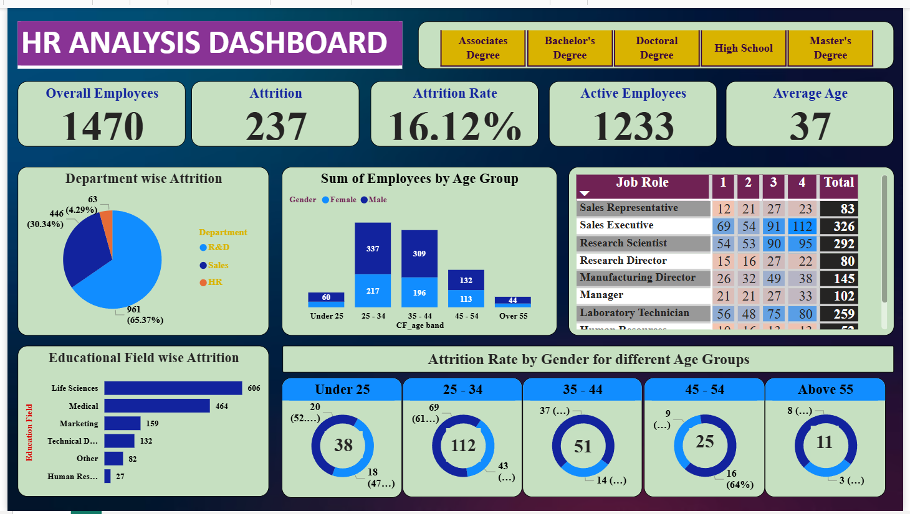

# HR Analysis

## 📊 Project Overview
This project presents an HR Analytics dashboard built using Power BI to analyze employee data, attrition trends, and workforce distribution. The dashboard helps organizations understand employee behavior and improve retention strategies.

## 🔧 Tools Used
- Power BI  
- Excel  

## 📈 Key Insights
- Total Employees: 1470  
- Attrition Count: 237  
- Attrition Rate: 16.12%  
- Active Employees: 1233  
- Average Employee Age: 37  

- Department-wise attrition analysis (R&D, Sales, HR)  
- Age group distribution of employees  
- Job role-wise employee count and attrition trends  
- Education field-wise attrition insights  
- Gender-based attrition analysis across different age groups  

## 📂 Files Included
- Power BI Dashboard (HR_Analysis.pbix)  
- Dataset (HR_Analysis_Dataset.xlsx)  
- Dashboard Screenshot (Dashboard.png)  

## 📷 Dashboard Preview

